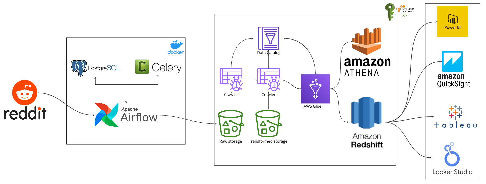

# Reddit Data Engineering Pipeline

A learning project using Python and Apache Airflow to extract Reddit posts, transform the data, save it as CSV, and upload it to Amazon S3.

## Overview

The Airflow DAG coordinates two tasks:

1. **Reddit extraction:** Retrieves posts from the `dataengineering` subreddit using the Reddit API.
2. **S3 upload:** Uploads the generated CSV file to Amazon S3 when valid AWS credentials and bucket configuration are provided.

## Architecture



*Architecture diagram from the original Airscholar project. This repository is adapted for learning.*
1.Reddit API: Source of the data.
2.Apache Airflow & Celery: Orchestrates the ETL process and manages task distribution.
3.PostgreSQL: Temporary storage and metadata management.
4.Amazon S3: Raw data storage.
5.AWS Glue: Data cataloging and ETL jobs.
6.Amazon Athena: SQL-based data transformation.
7.Amazon Redshift: Data warehousing and analytics.


## Technologies

- Python and Pandas
- Apache Airflow
- Docker Compose
- PostgreSQL
- Redis and Celery
- Amazon S3

## Project Structure

- `dags/` — Airflow DAG
- `etls/` — Reddit extraction and transformation
- `pipelines/` — Pipeline functions
- `config/` — Configuration files
- `data/output/` — CSV output

## Local Setup

### 1. Clone this repository

```bash
git clone https://github.com/harshvardhan0405/reddit_data_pipeline.git
cd reddit_data_pipeline

## Acknowledgement

This project is adapted from the Reddit Data Engineering project by Airscholar for learning and personal development.

Original source: https://github.com/airscholar/RedditDataEngineering
